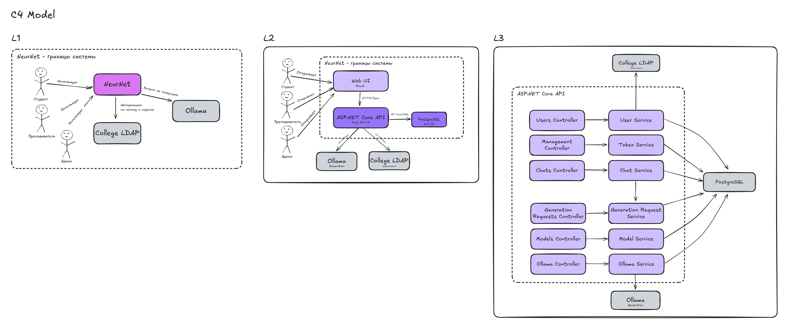

# Neur.Server.Net

[](https://github.com/NeurNet/Neur.Server.Net/actions/workflows/ci.yml)

 <br>

**Neur.Server.Net** — серверный API-сервис, предоставляющий централизованный доступ к бизнес-логике проекта [**NeurNet**](https://github.com/NeurNet).

## О проекте 🏗

### Чем занимается:

* Аутентификацией/авторизацией пользователей через **LDAP** сервис.
* Хранением данных пользователей: моделей, чатов, сообщений, истории запросов.
* Генерация ответа пользователю: взаимодействие с сервисом **Ollama**, передача контекста чата и возврат потокового ответа.
* Управлением токенами: начисление, списание и передача токенов между пользователями.
* Предоставлением API-эндпоинтов, в том числе привилегированных, для конкретных ролей

### Роли и права

- **Администратор**: начисление токенов, управление пользователями и моделями.
- **Преподаватель**: получение токенов от админа, распределение студентам.
- **Студент**: расход токенов на запросы к нейросети.

- - -

### Модель C4



### Диаграммы (use-case, class, activity)
Можете посмотреть [тут](.github/images/diagrams)


## ⚙️ Технологический стек

* **Язык программирования**: С# (NET 9.0) 
* **API-фреймворк**: ASP NET CORE (v9.0.9)
* **ORM**: Entity Framework Core (v9.0.10)
* **База данных:** PostgreSQL (v18)

## 🔗 Сторонние сервисы

1. [**Ollama**](https://ollama.com/) для взаимодействия с LLM моделями.
2. [**college-auth-svc**](https://github.com/anton1ks96/college-auth-svc) для аутентификации по логину и паролю в LDAP.

## Как собрать

1. [Install docker](https://www.docker.com/get-started/)
2. Запустите сервисы **Ollama**, **college-auth-svc**.
4. Настройте сервисы в `appsettings.json`:
```json
  "Services": {
    "OllamaClient": {
      "url": "http://10.3.25.90:11434" // API Ollama
    },
    "CollegeClient": {
      "url": "http://10.3.0.70:8000", // Сервис авторизации
      "TimeoutSeconds": 5
    },
    "Frontend": {
      "url": "http://localhost:5173" // Frontend URL (CORS)
    }
  }
```
5. Запустите через **docker**:

```bash
docker-compose up --build
```